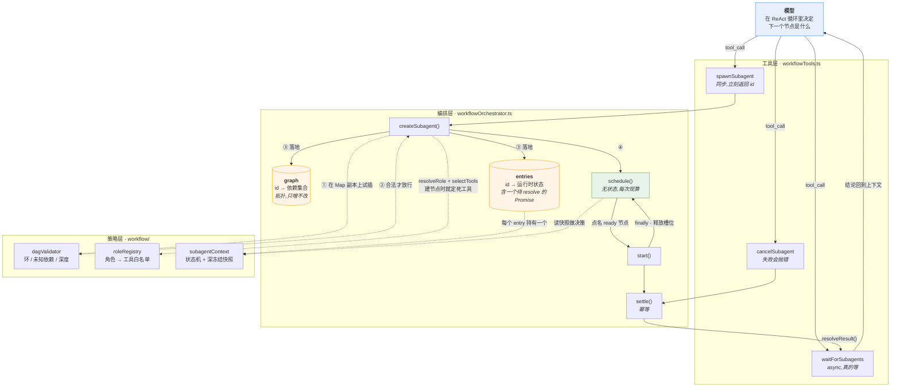

# 02 · 三个工具,就是全部编排

上一篇结尾说,主 Agent 的"派人干活"能力来自三个普通工具。这篇把它们摊开看。

先换一个任务。上一篇那个"加手机号登录"是**你大致知道该怎么做**的活儿,这次换一个你不知道的:

> 支付回调偶尔重复扣款,线上一天两三次,你查一下为什么,能修就修。

停下来想一想:**你现在能画出一张任务图吗?**

画不出来。因为"该修什么"完全取决于"是什么原因"——可能是回调根本没做幂等,可能做了但幂等键选错了,可能幂等状态存在进程内存里而线上是多实例,也可能是订单状态机允许了一个非法的重复流转。这四种情况要写的代码毫无共同之处。

这就是这篇要讲的事:图**不能**事前规划,只能一边看一边长。三个工具就是让它长出来的全部装置。

## 工具一:spawnSubagent

先看它的完整定义。注意这是一个**标准的 ReAct 工具**,和 `readFile` 的结构没有任何区别:

```ts
// workflowTools.ts
{
  name: "spawnSubagent",
  description: "Create a subagent to complete a task.",
  inputSchema: {
    type: "object",
    properties: {
      task: { type: "string", minLength: 1 },
      role: { type: "string", enum: ["explorer", "reviewer", "planner", "executor"] },
      dependsOn: { type: "array", items: { type: "string", minLength: 1 } },
      toolHints: { type: "array", items: { type: "string", minLength: 1 } },
      timeoutMs: { type: "integer", minimum: 1 },
    },
    required: ["task"],
  },
  isConcurrencySafe: () => true,
  invoke({ input }) {
    const config = parseCreateSubagentInput(input);
    return JSON.stringify({ subagentId: orchestrator.createSubagent(config, availableTools) });
  },
}
```

几个细节值得停一下:

**只有 `task` 是必填的。** 主 Agent 最少只需要说"干什么",角色默认是 `explorer`(最安全的只读角色)。

**`invoke` 是同步的,而且立刻返回。** 它不等子智能体跑完——只是登记一个节点,拿到 `subagentId` 就回来了。这个设计是"派人"和"等结果"必须分成两个工具的原因:如果 `spawnSubagent` 阻塞到结束,就没法先派三个再一起等,并行也就没了。

**`isConcurrencySafe: () => true`。** 还记得上个系列讲的并发分批吗?这个标记让主 Agent 可以**在一次模型回合里同时派出多个子智能体**。三个 `spawnSubagent` 调用会被归进同一个并行批次。

## 工具二:waitForSubagents

```ts
{
  name: "waitForSubagents",
  description: "Wait for subagents to finish and return their results.",
  inputSchema: {
    type: "object",
    properties: { subagentIds: { type: "array", items: { type: "string", minLength: 1 } } },
    required: ["subagentIds"],
  },
  isConcurrencySafe: () => true,
  async invoke({ input }) {
    const subagentIds = parseStringArray(input, "subagentIds");
    const results = await orchestrator.waitForSubagents(subagentIds);
    return JSON.stringify({ results: Object.fromEntries(results) as Record<string, SubagentResult> });
  },
}
```

这个是 `async` 的,会真的等。等的实现很朴素:

```ts
// workflowOrchestrator.ts
async waitForSubagents(ids) {
  const requested = ids.map((id) => {
    const entry = entries.get(id);
    if (!entry) throw new Error(`Subagent ${id} not found`);
    return [id, entry.result] as const;
  });
  const results = await Promise.all(requested.map(async ([id, result]) => [id, await result] as const));
  return new Map(results);
}
```

每个子智能体在登记时就挂了一个 Promise,`waitForSubagents` 就是 `Promise.all` 它们。注意这里**没有轮询、没有超时参数**——超时是子智能体自己的事(第 05 篇会讲),等的这一方只管等。

## 工具三:cancelSubagent

```ts
invoke({ input }) {
  const subagentId = parseStringProperty(input, "subagentId");
  if (!orchestrator.cancelSubagent(subagentId)) {
    throw new Error(`Subagent ${subagentId} was not found or is already finished`);
  }
  return JSON.stringify({ subagentId, cancelled: true });
}
```

值得注意的是**取消失败会抛错**。主 Agent 如果想撤回一个已经跑完的子智能体,会收到一条明确的 `Tool error`,而不是静默的"成功"。这让模型能知道自己的世界模型过期了。

## 任务图是"长"出来的,不是"规划"出来的

这是整个架构最容易误解的地方。

很多人想象的多智能体是这样:模型先输出一张完整的任务图(JSON 格式的 DAG),然后引擎照着图执行。

**LoopAgent 不是这样。** 它没有"先给我一张图"这一步。图是主 Agent 在自己的 ReAct 循环里,**一次一个节点**长出来的。回到开头那个重复扣款的任务:

```
主 Agent step 1: spawnSubagent(task="找支付回调入口,看有没有幂等校验")  → 图: {A}
主 Agent step 1: spawnSubagent(task="查订单状态机允许哪些重复流转")     → 图: {A, B}  (同一回合,并行)
主 Agent step 2: waitForSubagents([A, B])                            → 阻塞,等结果
主 Agent step 3: 看到 A 的结论,才知道该派谁
                 spawnSubagent(task="???", role="executor")          → 图: {A, B, C}
主 Agent step 4: waitForSubagents([C])
```

第 3 步那个 `???` 是这篇的全部重点。它填什么,取决于 A 说了什么:

| A 的结论 | C 实际会是什么 |
|---------|--------------|
| 回调里完全没有幂等校验 | 在入口加幂等键,用 `out_trade_no` 做唯一索引 |
| 有幂等校验,但键用的是自增 id | 换成业务唯一键,补一条 migration |
| 有幂等,但状态存在进程内存的 Map 里 | 挪到 Redis,**顺带**要处理线上多实例的滚动发布 |
| 幂等没问题,是状态机允许了重复流转 | 根本不碰回调,改 `OrderState` 的迁移表 |

四种结论对应四个完全不同的 C。**没有任何一张事前画好的图能覆盖这四种分支**——除非你把四个分支全画进去,然后运行时丢掉三个,那不叫规划,那叫穷举。

这是 ReAct 的本质优势:**它能根据观察结果调整计划**。

`✶ 动态成图 vs 预先规划`
预先规划的好处是可以做全局优化(比如提前算出最优并行度)。动态成图的好处是**能对现实做出反应**。在代码任务里,你几乎永远不知道下一步该干什么,直到你真的看了代码——所以动态成图几乎总是对的选择。代价是:你无法在开始时告诉用户"这个任务要跑 7 步"。

## 每插一个节点,就验一遍图

既然图是一个节点一个节点长的,那就有个风险:主 Agent 可能声明出一个**循环依赖**(A 等 B,B 等 A),或者依赖一个**不存在的节点**。

`createSubagent` 在真正登记之前,先做一次校验:

```ts
// workflowOrchestrator.ts
createSubagent(config, availableTools) {
  if (entries.size >= limits.maxSubagentsPerRun) {
    throw new Error(`Max subagents per run (${limits.maxSubagentsPerRun}) exceeded`);
  }

  const id = `subagent-${nextId}`;
  const dependencies = [...(config.dependsOn ?? [])];
  const nextGraph = new Map(graph);        // ← 先拷一份
  nextGraph.set(id, new Set(dependencies)); // ← 在副本上试插
  const validation = validateDAG(nextGraph, limits);
  if (!validation.valid) throw new Error(validation.error); // ← 不合法就抛，真图未被污染
  // ...校验通过后才 graph.set(id, ...) 和 entries.set(id, entry)
}
```

注意 `const nextGraph = new Map(graph)` 这一句。校验跑在**副本**上,不在真图上。所以一个非法的 `spawnSubagent` 调用抛错之后,真实的图和之前完全一样——不会留下一个半登记的坏节点。

这个"先在副本上试,通过了再落地"的模式,是保证状态机不会进入中间态的标准做法。

## 校验器做三件事

```ts
// workflow/dagValidator.ts
export function validateDAG(
  graph: ReadonlyMap<string, ReadonlySet<string>>,
  limits: Pick<WorkflowLimits, "maxNestingDepth">,
): DAGValidationResult {
  for (const dependencies of graph.values()) {
    for (const dependencyId of dependencies) {
      if (!graph.has(dependencyId)) return { valid: false, error: `Unknown dependency: ${dependencyId}` };
    }
  }

  if (detectCycle(graph)) {
    return { valid: false, error: "Circular dependency detected in subagent graph" };
  }

  const depth = calculateDAGDepth(graph);
  if (depth > limits.maxNestingDepth) {
    return {
      valid: false,
      error: `Subagent nesting depth (${depth}) exceeds limit (${limits.maxNestingDepth})`,
    };
  }

  return { valid: true };
}
```

**悬空依赖**、**环**、**深度超限**。前两个好理解,第三个有个容易误读的地方,值得单独说。

## `maxNestingDepth` 限制的不是"嵌套"

默认值是 3:

```ts
// workflowOrchestrator.ts
const DEFAULT_LIMITS: WorkflowLimits = {
  maxSubagentsPerRun: 50,
  maxNestingDepth: 3,
  maxConcurrentSubagents: 10,
  subagentTimeoutMs: 60_000,
  maxSubagentTimeoutMs: 300_000,
};
```

看名字,你会以为它限制的是"子智能体能不能再派子智能体,最多派几层"。

**不是。** 看深度是怎么算的:

```ts
// workflow/dagValidator.ts
export function calculateDAGDepth(graph: ReadonlyMap<string, ReadonlySet<string>>): number {
  const depths = new Map<string, number>();

  const depthOf = (id: string): number => {
    const cached = depths.get(id);
    if (cached !== undefined) return cached;

    const depth = Math.max(0, ...Array.from(graph.get(id) ?? [], depthOf)) + 1;
    depths.set(id, depth);
    return depth;
  };

  return Math.max(0, ...[...graph.keys()].map(depthOf));
}
```

它算的是**依赖链的长度**。测试里写得很清楚:

```ts
// test/workflow/dagValidator.test.ts
const graph = new Map<string, Set<string>>([
  ["root", new Set()],
  ["build", new Set(["root"])],
  ["test", new Set(["build"])],
]);

expect(validateDAG(graph, { maxNestingDepth: 3 })).toEqual({ valid: true });
expect(validateDAG(graph, { maxNestingDepth: 2 })).toEqual({
  valid: false,
  error: "Subagent nesting depth (3) exceeds limit (2)",
});
```

`root → build → test` 三个**平级**的子智能体,串成一条依赖链,深度就是 3。它们全都是主 Agent 的直接下属,没有任何"嵌套"。

那真正的嵌套呢?**在这套实现里根本不可能发生。** 因为四个角色的工具白名单里,没有任何一个包含 `spawnSubagent`——子智能体拿不到派人的工具。层级恒定是两层:主 Agent + 子智能体。

`✶ 一个名字带来的误解`
`maxNestingDepth` 这个名字描述的是设计者当初的意图(限制递归深度),但代码实际实现的是依赖链长度限制。两者在"子智能体不能派子智能体"的前提下,恰好都是有意义的约束,所以这个偏差一直没暴露成 bug。读代码时遇到名字和行为不一致,**信行为,不信名字**——这也是为什么上面每个结论我都贴了测试断言。

## 接线:workflow 工具是可选的

最后看这三个工具怎么装到主 Agent 上:

```ts
// model/providerRegistry.ts
if (deps.enableWorkflowTools === false) return createParentRunner(parentTools, deps.requiredToolNames, REACT_SYSTEM_PROMPT);

return {
  async *run(request) {
    const events = createAsyncQueue<HostToWebviewMessage>();
    const orchestrator = createWorkflowOrchestrator({ /* ... */ });
    const unsubscribe = orchestrator.onEvent((event) => events.push(toHostMessage(event, request.runId)));
    const workflowTools = createWorkflowTools({
      orchestrator,
      availableTools: parentTools,
    });
    const tools = [...parentTools, ...workflowTools];   // ← 就是数组拼接
    // ...
  },
};
```

`enableWorkflowTools === false` 时直接返回**普通的单智能体 runner**,一行编排代码都不执行。开启时,也只是 `[...parentTools, ...workflowTools]` ——把三个工具拼进数组。

多智能体在这里是一个**纯增量能力**。这也解释了为什么它能不动 ReAct 循环就接上:对循环来说,工具箱里多三个工具,和多三个文件读写工具,没有任何区别。

## 全景:四层,一个写入口

把前面所有零件拼起来看:



这张图里有两件事值得单独指出来。

**图只有一个写入口。** 所有对 `graph` 的修改都必须经过 `createSubagent`,而它进门第一件事就是在副本上跑校验。没有任何旁路能往图里插节点——包括子智能体自己,因为上一节说过,四个角色的工具白名单里都没有 `spawnSubagent`。图的形状**只由主 Agent 决定**。

**`schedule()` 被两处调用,构成了整个引擎的时钟。** 一条是"图变大了"(`createSubagent` 末尾),一条是"有节点跑完了"(`start()` 的 `finally`)。除此之外没有轮询、没有定时器推动执行。图的可执行状态只会因为这两件事变化,所以只需要在这两个时刻重新点名。

图长出来了,节点登记好了。但谁决定哪个节点先跑?下一篇讲调度器。

---

## 关于 LoopAgent

本文代码来自 [LoopAgent](https://github.com/oi12344/loopagent-vscode)。涉及的文件:

- [src/extension/agent/workflowTools.ts](https://github.com/oi12344/loopagent-vscode/blob/94c5948fd472a14f51558ac2421e8c42f0d8e0ed/src/extension/agent/workflowTools.ts) — 三个工具的定义
- [src/extension/agent/workflowOrchestrator.ts](https://github.com/oi12344/loopagent-vscode/blob/94c5948fd472a14f51558ac2421e8c42f0d8e0ed/src/extension/agent/workflowOrchestrator.ts) — 编排器主体
- [src/extension/agent/workflow/dagValidator.ts](https://github.com/oi12344/loopagent-vscode/blob/94c5948fd472a14f51558ac2421e8c42f0d8e0ed/src/extension/agent/workflow/dagValidator.ts) — 图校验
- [src/extension/model/providerRegistry.ts](https://github.com/oi12344/loopagent-vscode/blob/94c5948fd472a14f51558ac2421e8c42f0d8e0ed/src/extension/model/providerRegistry.ts) — 接线

欢迎点个 star ⭐

**项目地址**:https://github.com/oi12344/loopagent-vscode

---

📖 上一篇:01 · 一个 Agent 不够用的那一刻 ｜ 下一篇:03 · 谁能跑,谁得等
