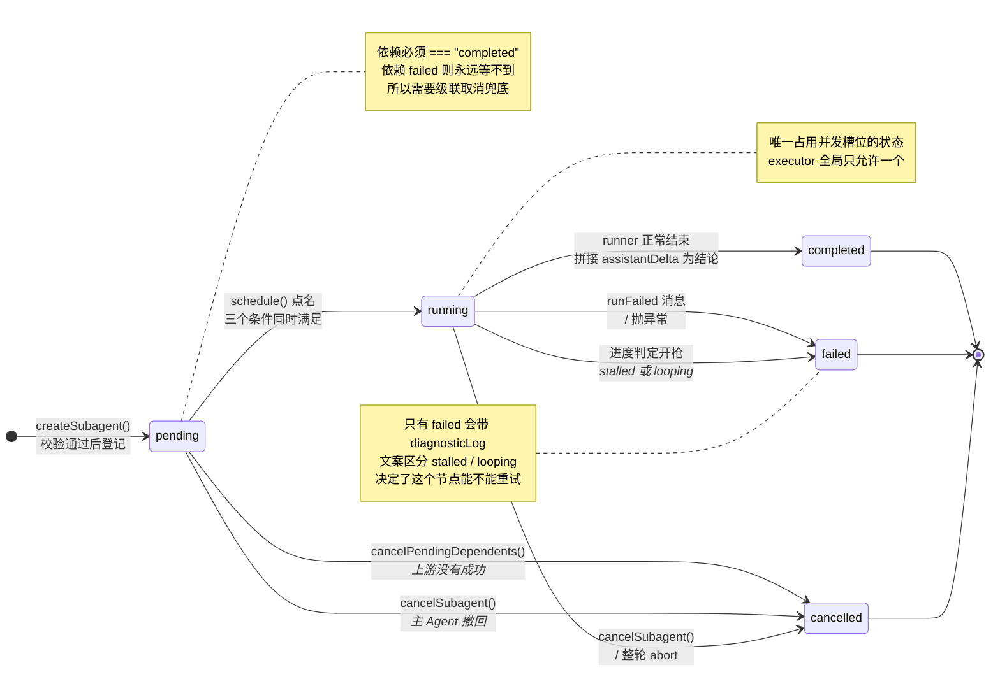

# 03 · 谁能跑,谁得等

节点登记进图了,但登记 ≠ 开跑。一个刚创建的子智能体状态是 `pending`,它要等调度器点名。

换个任务来看点名的规则。假设你说:

> order、payment、shipping 三个模块的日志都换成新的结构化 logger。先把 logger 封装好,再逐个模块替换,别把测试搞崩。

主 Agent 会长出这样一张图——注意这次**用户自己把依赖关系说出来了**("先……再……"):

```
                    ┌─→ B  替换 order 模块     (executor)
A  封装 logger ─────┼─→ C  替换 payment 模块   (executor)
   (executor)       └─→ D  替换 shipping 模块  (executor)
```

四个节点,三个问题立刻冒出来:

1. B、C、D 都依赖 A。**A 没好之前谁拦着它们别动?**
2. B、C、D 都要改文件,而且都会碰到那个新 logger 的导入路径。**三个同时改,谁保证不互相覆盖?**
3. 万一 A 失败了(比如发现项目里根本没装那个 logger 库),B、C、D 还老老实实等在 `pending`。**谁去给它们收尸?**

这三个问题的答案全在调度器里。有意思的是,整个调度逻辑只有 **12 行**。

## 全部的调度代码

```ts
// workflowOrchestrator.ts
function schedule(): void {
  if (cancellingAll || options.signal?.aborted) return;

  while (running.size < limits.maxConcurrentSubagents) {
    const hasRunningExecutor = [...running].some((id) => entries.get(id)?.context.snapshot().role === "executor");
    const ready = [...entries.values()].find((entry) => {
      const snapshot = entry.context.snapshot();
      return snapshot.status === "pending"
        && !(snapshot.role === "executor" && hasRunningExecutor)
        && snapshot.dependsOn.every((id) => entries.get(id)?.context.snapshot().status === "completed");
    });
    if (!ready) return;
    void start(ready);
  }
}
```

一层 `while`,一个 `find`,三个条件。拆开看。

## 条件一:必须是 pending

```ts
snapshot.status === "pending"
```

状态机有五个状态:

```ts
// workflow/types.ts
export type SubagentStatus = "pending" | "running" | "completed" | "failed" | "cancelled";
```

只有 `pending` 能被点名。`running` 的已经在跑,后三个是终态。终态判定单独抽了个函数:

```ts
function isTerminal(status: SubagentStatus): boolean {
  return status === "completed" || status === "failed" || status === "cancelled";
}
```

五个状态之间的迁移,以及每条边由谁触发:



三个终态都是**一次性**的:`context.finish()` 里那句 `if (finishedAt) return` 保证状态定了就不再变。这也是为什么 `settle()` 可以被反复调用而不出问题——下面讲级联取消时会看到,这个幂等性正是递归能终止的原因。

值得注意的是**没有从终态回到 `pending` 的边**。失败的节点不会自动重试,重试意味着主 Agent 重新 `spawnSubagent` 一个新节点(拿到新 id)。图只增不改,这条规则在状态机上也成立。

## 条件二:依赖必须全部 completed

**这是问题 1 的答案。**

```ts
snapshot.dependsOn.every((id) => entries.get(id)?.context.snapshot().status === "completed")
```

B、C、D 的 `dependsOn` 里都有 A。只要 A 还没 `completed`,这个 `every` 就返回 false,三个节点在 `find` 里永远匹配不上——不需要队列、不需要通知机制,拓扑序是**每次点名时现算出来的**。

注意这里是 `=== "completed"`,**不是** `isTerminal()`。差别很关键:

如果依赖 `failed` 了,`every` 返回 false,这个节点**永远等不到**。它不会跑,也不会自己变成终态——会一直挂在 `pending`。

这显然不行,所以有专门的级联取消(下面讲)。但先记住这个设计取向:**依赖失败,下游不许继续**。不存在"依赖挂了我凑合着跑"这种妥协。

## 条件三:executor 必须串行

**这是问题 2 的答案。**

```ts
const hasRunningExecutor = [...running].some((id) => entries.get(id)?.context.snapshot().role === "executor");
// ...
&& !(snapshot.role === "executor" && hasRunningExecutor)
```

这是整段代码里唯一带业务判断的一行:**同一时刻最多只有一个 executor 在跑**。

所以 A 完成后,B、C、D 三个的依赖同时满足了,但它们**不会**一起启动——调度器只放一个进去,另两个继续等。用户那句"逐个模块替换"不是靠提示词让模型自觉,是这一行代码强制的。

为什么?因为 executor 是唯一能拿到 `applyEdit` 和 `runCommand` 的角色(第 04 篇细讲)。两个 executor 并行意味着**两个 Agent 同时改同一个工作区的文件**——它们会互相覆盖。

而 explorer / reviewer / planner 都是只读的,并行读毫无风险。所以策略是:

```
读操作 → 随便并行，最多 10 个
写操作 → 严格串行，同时最多 1 个
```

`✶ 这是"读并行、写串行"在 Agent 层面的复刻`
数据库里的读写锁、Rust 的 `RwLock`、以及上个系列讲的 ReAct 工具分批,用的是同一个原理:**只读操作之间不冲突,一旦有写就必须独占**。区别在于粒度——数据库锁的是行,这里锁的是整个工作区。粒度粗,但对 Agent 场景够用,因为一个 executor 改哪些文件是它自己临场决定的,事前无法预测,没法做细粒度锁。

顺便说:第 06 篇会讲 git worktree,那是在这个串行约束之外的**另一条路**——给每个 executor 一个独立的文件系统副本,这样它们就真能并行写了。两个机制同时存在,worktree 是增强,串行是兜底。

## 心跳从哪来

`schedule()` 自己不循环,它是被**事件驱动**的。两个触发点:

**一,新节点登记后:**

```ts
// createSubagent 末尾
emit({ type: "SubagentCreated", subagentId: id, task: config.task, role: profile.id, dependsOn: dependencies });
if (options.signal?.aborted) cancelSubagent(id);
else schedule();
```

**二,任何节点跑完后:**

```ts
// start() 的 finally
} finally {
  running.delete(snapshot.id);
  if (!cancellingAll) schedule();
}
```

就这两处。图的状态只会因为"多了个节点"或"少了个在跑的节点"而变化,所以只需要在这两个时刻重新点名。

`while (running.size < limits.maxConcurrentSubagents)` 那层循环的作用是:一次心跳里**尽可能多地填满并发槽位**。比如一个节点跑完释放了槽位,而此时有 3 个 pending 节点的依赖恰好都满足了,那这一次 `schedule()` 就会连续启动 3 个,不用等 3 次心跳。

## 失败级联:不让下游白等

**这是问题 3 的答案。**

回到条件二那个问题——依赖 `failed` 了,下游会永远挂着。放在那个 logger 任务上就是:A 发现项目里没装 logger 库,失败了,而 B、C、D 的 `every` 永远等不到 `completed`。三个节点会挂在 `pending` 直到整轮结束,主 Agent 那句 `waitForSubagents([B, C, D])` 也就永远不返回。

解法在 `settle()` 里:

```ts
// workflowOrchestrator.ts
function settle(entry: SubagentEntry, result: SubagentResult): void {
  const snapshot = entry.context.snapshot();
  if (isTerminal(snapshot.status)) return;      // ← 幂等保护

  if (entry.timeout) clearTimeout(entry.timeout);
  // ...
  entry.context.finish(settledResult);
  entry.resolveResult(settledResult);
  emit({ type: "SubagentStatusChanged", subagentId: snapshot.id, status: result.status });

  if (result.status !== "completed") cancelPendingDependents(snapshot.id);   // ← 级联
  // ...
}
```

`if (result.status !== "completed") cancelPendingDependents(...)`。只要不是成功,就去取消所有等它的节点:

```ts
function cancelPendingDependents(dependencyId: string): void {
  for (const entry of entries.values()) {
    const snapshot = entry.context.snapshot();
    if (snapshot.status !== "pending" || !snapshot.dependsOn.includes(dependencyId)) continue;
    settle(entry, {
      status: "cancelled",
      error: `Dependency ${dependencyId} did not complete successfully`,
    });
  }
}
```

放在 logger 那张图上,一次调用就够了——B、C、D 都直接依赖 A,全在同一层:

```
A 失败
 └─ settle(A, failed)
     └─ cancelPendingDependents(A)
         ├─ B → settle(B, cancelled)   "Dependency subagent-1 did not complete successfully"
         ├─ C → settle(C, cancelled)
         └─ D → settle(D, cancelled)
```

但依赖链更深时呢?注意 `cancelPendingDependents` 内部调的还是 `settle()`,而 `settle()` 又会调 `cancelPendingDependents()`。这是**递归**,所以链有多长就传多远:

```
A 失败
 └─ settle(A, failed)
     └─ cancelPendingDependents(A)
         └─ B 依赖 A → settle(B, cancelled)
             └─ cancelPendingDependents(B)
                 └─ C 依赖 B → settle(C, cancelled)
```

一次失败会顺着依赖链把整条下游全部标成 `cancelled`。递归能终止,靠的是 `settle()` 开头那句 `if (isTerminal(snapshot.status)) return` ——已经是终态的节点直接返回,不会二次触发。

还有一处不对称值得注意:`cancelPendingDependents` 的过滤条件是 `snapshot.status !== "pending" → continue`,所以它**只取消 pending 的下游,不碰正在 running 的**。

这不是遗漏。一个节点能进入 `running`,前提是它的依赖当时全部 `completed`(条件二)。也就是说它启动时拿到的输入是完整有效的,上游此刻的失败并不能让那份已经交付的输入变质。掐掉它只会白扔一个正在推进的任务。

```
A ──> B (running)   A 现在失败了 → B 不受影响,继续跑
                     因为 B 启动时 A 是 completed,输入已经拿到手了

A ──> C (pending)   A 现在失败了 → C 立刻 cancelled
                     因为 C 还没拿到任何东西,等下去也等不到了
```

`✶ 幂等是递归安全的前提`
`settle()` 那句 `isTerminal` 检查看起来只是"防重复调用",实际上它是这段递归的**终止条件**。如果没有它,一个菱形依赖(D 同时依赖 B 和 C,B 和 C 都依赖 A)在 A 失败时会让 D 被 settle 两次。写状态机时,让每个状态转换函数幂等,能省掉大量显式的访问标记。

## 一个节点从 pending 到 running

`start()` 是真正启动子智能体的地方。这里只看它的骨架,超时和 worktree 留给后面两篇:

```ts
// workflowOrchestrator.ts (简化)
async function start(entry: SubagentEntry): Promise<void> {
  const snapshot = entry.context.snapshot();
  entry.context.start();                        // pending → running
  running.add(snapshot.id);
  const controller = new AbortController();
  entry.controller = controller;

  try {
    emit({ type: "SubagentStatusChanged", subagentId: snapshot.id, status: "running" });
    if (controller.signal.aborted || entry.context.snapshot().status !== "running") return;

    scheduleProgressCheck();                    // ← 第 05 篇

    const runner = await options.createRunner({  // ← 造一个 ReAct runner
      subagentId: snapshot.id,
      task: snapshot.task,
      role: snapshot.role,
      signal: controller.signal,
      tools: snapshot.tools,
      invokeTool: /* ... 第 06 篇 */,
    });

    let failure: string | undefined;
    for await (const message of runner.run({ runId: snapshot.id, task: snapshot.task, signal: controller.signal })) {
      if (controller.signal.aborted) break;
      const savedMessage = structuredClone(message);
      entry.messages.push(savedMessage);
      emit({ type: "SubagentMessage", subagentId: snapshot.id, message: structuredClone(savedMessage) });
      if (message.type === "runFailed") {
        failure = message.message;
        break;
      }
    }

    if (failure) {
      controller.abort();
      settle(entry, { status: "failed", error: failure });
      return;
    }
    if (entry.context.snapshot().status !== "running") return;

    const content = entry.messages
      .filter((message): message is Extract<HostToWebviewMessage, { type: "assistantDelta" }> => message.type === "assistantDelta")
      .map((message) => message.content)
      .join("");
    settle(entry, { status: "completed", ...(content ? { content } : {}) });
  } catch (error) {
    if (entry.context.snapshot().status === "running") {
      settle(entry, { status: "failed", error: formatError(error) });
    }
  } finally {
    running.delete(snapshot.id);
    if (!cancellingAll) schedule();
  }
}
```

几个值得注意的点:

**结论是"拼出来"的。** 子智能体的最终答案不是某个字段,而是把所有 `assistantDelta` 消息的 `content` 拼接起来。这就是主 Agent 最终收到的那句话。

**每条消息都留了两份。** `entry.messages.push(savedMessage)` 存一份用于后续分析(进度判定、验证检测、诊断日志),`emit(...)` 发一份给 UI。两份都是 `structuredClone` 出来的独立副本——避免 UI 侧或分析侧的任何改动串到对方。

**到处在检查 `status !== "running"`。** 四处。因为 `await` 期间任何事都可能发生:用户取消了、超时判定开了枪、依赖失败级联过来了。每次从 `await` 回来都要重新确认"我还该继续吗"。

`✶ async 函数里的状态检查密度`
这种"每个 await 后面跟一次状态检查"的写法看着啰嗦,但在有外部取消源的异步流程里是必需的。`await` 是一个**让世界改变的窗口**——你挂起时持有的任何假设,恢复后都可能已经失效。检查漏一个,就是一个"已取消的子智能体又冒出来 settle 一次"的诡异 bug。

## 状态快照为什么处处 freeze

上面代码里满眼 `entry.context.snapshot()`。这个 snapshot 不是简单的对象引用:

```ts
// subagentContext.ts
snapshot() {
  return Object.freeze({
    id, task, role,
    dependsOn: dependencies,
    tools: assignedTools,
    status,
    result: result && copyResult(result),
    startedAt: startedAt && new Date(startedAt),
    finishedAt: finishedAt && new Date(finishedAt),
    messages: Object.freeze(messages.map(copyMessage)),
  });
}

function copyMessage(message: ReactAgentMessage): ReactAgentMessage {
  return deepFreeze(structuredClone(message));
}

function deepFreeze<T>(value: T): T {
  if (value && typeof value === "object") {
    for (const child of Object.values(value)) deepFreeze(child);
    Object.freeze(value);
  }
  return value;
}
```

每次 `snapshot()` 都做深拷贝 + 深冻结,连 `Date` 都重新 `new` 一个。

调度器在 `find` 回调里频繁读快照,如果快照是活引用,那"读到一半状态变了"就是随时可能的事。深冻结让每个快照成为**一个时刻的确定事实**,调度决策基于它就不会自相矛盾。代价是性能——但子智能体数量上限是 50,这点开销无关紧要。

调度器决定了**谁跑**。下一篇讲**它跑的时候能干什么**——角色和权限。

---

## 关于 LoopAgent

本文代码来自 [LoopAgent](https://github.com/oi12344/loopagent-vscode)。涉及的文件:

- [src/extension/agent/workflowOrchestrator.ts](https://github.com/oi12344/loopagent-vscode/blob/94c5948fd472a14f51558ac2421e8c42f0d8e0ed/src/extension/agent/workflowOrchestrator.ts) — 调度器、级联取消、启动流程
- [src/extension/agent/subagentContext.ts](https://github.com/oi12344/loopagent-vscode/blob/94c5948fd472a14f51558ac2421e8c42f0d8e0ed/src/extension/agent/subagentContext.ts) — 不可变状态快照
- [src/extension/agent/workflow/types.ts](https://github.com/oi12344/loopagent-vscode/blob/94c5948fd472a14f51558ac2421e8c42f0d8e0ed/src/extension/agent/workflow/types.ts) — 状态与限额类型

欢迎点个 star ⭐

**项目地址**:https://github.com/oi12344/loopagent-vscode

---

📖 上一篇:02 · 三个工具,就是全部编排 ｜ 下一篇:04 · 四个角色,四套权限
