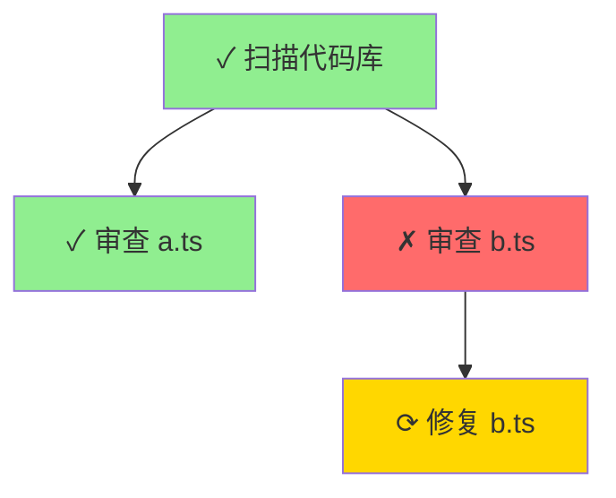

# 动态工作流与子智能体协同机制

## 概述

动态工作流（Dynamic Workflow）通过 `DynamicGraphEngine` 协调多个子智能体（Subagent）的执行，实现复杂任务的高效完成。本文档详细说明两者的协同机制、数据流管理和最佳实践。

---

## 核心架构

### 三层协同模型

```
┌─────────────────────────────────────────┐
│   DynamicGraphEngine (编排层)           │
│   - DAG 拓扑管理                         │
│   - 依赖解析                             │
│   - 并行调度                             │
└──────────────┬──────────────────────────┘
               │
               ▼
┌─────────────────────────────────────────┐
│   WorkflowOrchestrator (执行层)         │
│   - 子智能体生命周期管理                 │
│   - 工具路由和角色解析                   │
│   - DAG 验证和并发控制                   │
└──────────────┬──────────────────────────┘
               │
               ▼
┌─────────────────────────────────────────┐
│   Subagents (工作层)                    │
│   - 独立任务执行                         │
│   - 专业化角色（explorer/reviewer等）    │
│   - 工具调用和结果生成                   │
└─────────────────────────────────────────┘
```

---

## 核心协同机制

### 1. 节点到子智能体的映射

**关键代码**：[dynamicGraphEngine.ts:166-208](src/extension/agent/workflow/dynamicGraphEngine.ts#L166-L208)

```typescript
async function executeNode(node: DynamicNode, completedNodes) {
    // 1️⃣ 条件评估：决定是否跳过节点
    if (!evaluateCondition(node, completedNodes)) {
        updateNodeStatus(node.config.id, "skipped");
        return;
    }

    // 2️⃣ 数据准备：从依赖节点提取输入数据
    const inputData = prepareNodeInput(node, completedNodes);
    
    // 3️⃣ 子智能体创建：一个节点 = 一个子智能体
    const subagentId = orchestrator.createSubagent({
        task: node.config.task,           // 任务描述
        role: node.config.role,           // 角色（如 explorer）
        toolHints: node.config.toolHints, // 工具提示
        dependsOn: [依赖的子智能体ID列表] // 继承上下文
    }, availableTools);
    
    // 4️⃣ 等待执行：阻塞直到子智能体完成
    const results = await orchestrator.waitForSubagents([subagentId]);
    
    // 5️⃣ 结果记录：更新节点状态和数据流
    node.result = result;
    dataFlowManager.recordOutput(node.config.id, result);
    
    // 6️⃣ 动态扩展：根据结果生成新节点
    await resolveDependencies(node.config.id, newCompletedNodes);
}
```

**关键特性**：
- **1:1 映射**：每个图节点对应一个子智能体实例
- **生命周期绑定**：节点状态 `pending → ready → running → completed/failed` 与子智能体同步
- **上下文继承**：通过 `dependsOn` 字段传递依赖子智能体的 ID，实现上下文共享

---

### 2. 并行执行策略

**调度逻辑**：[dynamicGraphEngine.ts:233-269](src/extension/agent/workflow/dynamicGraphEngine.ts#L233-L269)

```typescript
async function execute() {
    while (!cancelled && !signal?.aborted) {
        // 🔍 发现所有就绪节点（依赖已满足）
        const readyNodes = Array.from(context.nodes.values()).filter(
            (node) =>
                node.status === "pending" &&
                Array.from(node.dependencies).every((depId) => {
                    const depNode = context.nodes.get(depId);
                    return depNode?.status === "completed" || 
                           depNode?.status === "skipped";
                })
        );

        // 🚀 并行执行所有就绪节点
        await Promise.all(readyNodes.map(node => executeNode(node, completedNodes)));
    }
}
```

**效率优势**：
- **最大化并行度**：所有依赖已满足的节点同时执行
- **零等待时间**：无需人工指定并行组，自动根据依赖关系调度
- **动态适应**：节点完成后立即触发下游节点检查

**示例场景**：
```
初始状态：
  A (pending)
  B (pending)
  C (pending, depends on A, B)
  D (pending, depends on A)

第 1 轮：并行执行 A、B （无依赖）
第 2 轮：并行执行 C、D （A、B 已完成）
```

---

### 3. 数据流管理

**组件**：[dataFlowManager.ts](src/extension/agent/workflow/dataFlowManager.ts)

#### 3.1 输入映射（Input Mapping）

**功能**：从依赖节点的输出提取数据作为当前节点的输入

**表达式语法**：
```typescript
// 节点字段引用
"nodeA.content"        → 节点 A 的输出内容
"nodeA.status"         → 节点 A 的状态
"nodeA.error"          → 节点 A 的错误信息

// JSON 路径访问
"nodeA.content.result.summary"  → 深层嵌套字段

// 数组访问
"nodeA.content[0]"     → 数组第一个元素

// 全局数据
"$globalVariable"      → 访问全局共享数据

// 字面量
"true", "123", "'text'"
```

**使用示例**：
```typescript
{
    id: "summarize",
    task: "总结前面的分析结果",
    inputMapping: {
        // 从节点 "analyze" 的输出提取关键发现
        findings: "analyze.content.keyFindings",
        // 从节点 "scan" 获取文件列表
        files: "scan.content"
    }
}
```

#### 3.2 数据流记录

**自动跟踪**：[dynamicGraphEngine.ts:161, 200](src/extension/agent/workflow/dynamicGraphEngine.ts#L161)

```typescript
// 节点执行前：记录输入
dataFlowManager.recordInput(node.config.id, inputData);

// 节点执行后：记录输出
dataFlowManager.recordOutput(node.config.id, result);
```

**历史追溯**：
```typescript
// 查询某节点的所有数据流
const records = dataFlowManager.getNodeData("nodeA");
// 返回: [{ source: "input", data: {...} }, { source: "output", data: {...} }]

// 获取完整执行历史
const history = dataFlowManager.getFlowHistory();
```

---

### 4. 条件执行

**条件类型**：[dynamicGraphTypes.ts:17-20](src/extension/agent/workflow/dynamicGraphTypes.ts#L17-L20)

```typescript
type NodeCondition = {
    type: "always" | "onSuccess" | "onFailure" | "custom";
    expression?: string;
};
```

**评估逻辑**：[dynamicGraphEngine.ts:128-147](src/extension/agent/workflow/dynamicGraphEngine.ts#L128-L147)

| 条件类型 | 执行条件 | 典型场景 |
|---------|---------|---------|
| `always` | 总是执行 | 清理任务、日志记录 |
| `onSuccess` | 所有依赖节点成功 | 正常流程 |
| `onFailure` | 至少一个依赖节点失败 | 错误处理、回滚 |
| `custom` | 自定义表达式（**待实现**） | 复杂业务逻辑 |

**使用示例**：
```typescript
{
    id: "rollback",
    task: "回滚刚才的数据库迁移",
    condition: { type: "onFailure" },
    dependencies: ["migrate"]
}
```

---

### 5. 动态节点生成

**机制**：[dynamicGraphEngine.ts:210-231](src/extension/agent/workflow/dynamicGraphEngine.ts#L210-L231)

```typescript
async function resolveDependencies(nodeId, completedNodes) {
    const resolver = definition.resolvers?.get(nodeId);
    if (!resolver) return;
    
    // 调用自定义解析器，根据当前节点结果生成新节点
    const newNodeConfigs = await resolver(nodeId, completedNodes, context);
    
    for (const config of newNodeConfigs) {
        addNode(config, [nodeId]); // 新节点依赖当前节点
    }
}
```

**Resolver 签名**：
```typescript
type DependencyResolver = (
    nodeId: DynamicNodeId,
    completedNodes: ReadonlyMap<DynamicNodeId, SubagentResult>,
    context: GraphComputationContext
) => Promise<DynamicNodeConfig[]>;
```

**应用场景**：

#### 场景 1：批量并行处理
```typescript
resolvers.set("scan", async (nodeId, completed, ctx) => {
    const scanResult = completed.get(nodeId);
    const files = JSON.parse(scanResult.content); // ["a.ts", "b.ts", "c.ts"]
    
    // 为每个文件生成一个分析节点
    return files.map(file => ({
        id: `analyze_${file}`,
        task: `分析文件 ${file} 的代码质量`,
        role: "reviewer"
    }));
});
```

生成的图结构：
```
scan (完成) → analyze_a.ts (并行)
            → analyze_b.ts (并行)
            → analyze_c.ts (并行)
```

#### 场景 2：条件分支
```typescript
resolvers.set("check", async (nodeId, completed) => {
    const checkResult = completed.get(nodeId);
    const hasErrors = checkResult.content.includes("ERROR");
    
    if (hasErrors) {
        return [{ id: "fix", task: "修复检测到的错误" }];
    } else {
        return [{ id: "deploy", task: "部署到生产环境" }];
    }
});
```

#### 场景 3：迭代优化（需扩展支持循环）
```typescript
resolvers.set("optimize", async (nodeId, completed, ctx) => {
    const iterationCount = ctx.globalData.get("iterations") || 0;
    const score = parseFloat(completed.get(nodeId).content);
    
    if (score < 0.9 && iterationCount < 5) {
        ctx.globalData.set("iterations", iterationCount + 1);
        return [{
            id: `optimize_iter${iterationCount + 1}`,
            task: "继续优化参数以提升性能"
        }];
    }
    return []; // 收敛或达到最大迭代次数
});
```

---

### 6. 子智能体角色系统

**角色定义**：[types.ts:6-12](src/extension/agent/workflow/types.ts#L6-L12)

```typescript
type SubagentRoleId = "explorer" | "reviewer" | "planner";

type SubagentRoleProfile = {
    id: SubagentRoleId;
    systemPrompt: string;      // 角色专属提示词
    allowedTools: string[];    // 允许使用的工具列表
};
```

**角色特性**：

| 角色 | 职责 | 典型工具 | 使用场景 |
|-----|------|---------|---------|
| `explorer` | 探索和信息收集 | `Read`, `Grep`, `Glob` | 代码库扫描、依赖分析 |
| `reviewer` | 审查和质量检查 | `Read`, `Bash`（运行测试） | 代码审查、安全检查 |
| `planner` | 规划和架构设计 | 轻量级工具 | 任务分解、方案设计 |

**工具路由**：`WorkflowOrchestrator` 根据角色自动过滤可用工具

```typescript
const subagentId = orchestrator.createSubagent({
    task: "扫描所有 TypeScript 文件",
    role: "explorer" // → 自动获得文件操作工具，屏蔽写入工具
}, availableTools);
```

---

## 高效协同的关键机制

### 1. 智能调度

**零空闲时间**：
- 主循环持续检查就绪节点（100ms 轮询）
- 一旦依赖满足立即启动子智能体
- 无需等待整批节点完成

**防止资源过载**：
```typescript
// WorkflowOrchestrator 的并发限制
const DEFAULT_LIMITS = {
    maxConcurrentSubagents: 50,  // 最大同时运行的子智能体数
    maxSubagentsPerRun: 50       // 单次工作流总子智能体上限
};
```

### 2. 渐进式执行

**动态扩展图**：
- 初始图可以很小（甚至单节点）
- 根据中间结果逐步展开后续任务
- 避免预先生成大量不必要的节点

**示例流程**：
```
初始：[扫描根目录]
  ↓ (发现 3 个子目录)
第 1 层：[扫描 src] [扫描 test] [扫描 docs]
  ↓ (src 中发现 50 个文件)
第 2 层：[分析 file1.ts] ... [分析 file50.ts]
  ↓ (发现 5 个高风险文件)
第 3 层：[深度审查 risk1.ts] ... [深度审查 risk5.ts]
```

### 3. 上下文共享

**依赖链传递**：[dynamicGraphEngine.ts:183-185](src/extension/agent/workflow/dynamicGraphEngine.ts#L183-L185)

```typescript
dependsOn: Array.from(node.dependencies)
    .map(depId => context.nodes.get(depId)?.subagentId)
    .filter((id): id is string => !!id)
```

子智能体可以访问其依赖子智能体的完整对话历史，实现上下文继承。

### 4. 错误隔离

**独立失败**：
- 单个节点失败不会影响无依赖关系的其他节点
- 通过 `onFailure` 条件实现错误处理分支
- `skipped` 状态允许下游节点继续（如可选优化步骤）

---

## 实战示例：代码库审查工作流

### 完整配置

```typescript
const reviewWorkflow: DynamicGraphDefinition = {
    initialNodes: [
        {
            id: "scan",
            task: "扫描代码库，列出所有 TypeScript 文件",
            role: "explorer"
        }
    ],
    
    resolvers: new Map([
        // 扫描完成后：为每个文件生成审查节点
        ["scan", async (nodeId, completed) => {
            const scanResult = completed.get(nodeId);
            const files: string[] = JSON.parse(scanResult.content || "[]");
            
            return files.map(file => ({
                id: `review_${file.replace(/[^a-z0-9]/gi, "_")}`,
                task: `审查文件 ${file}，检查安全漏洞和代码质量问题`,
                role: "reviewer",
                inputMapping: {
                    targetFile: `"${file}"` // 传递文件名
                }
            }));
        }],
        
        // 每个审查节点完成后：如果发现严重问题，生成修复节点
        ...Array.from({length: 100}, (_, i) => {
            const fileId = `review_file${i}`;
            return [fileId, async (nodeId, completed) => {
                const reviewResult = completed.get(nodeId);
                const issues = JSON.parse(reviewResult.content || "{}");
                
                if (issues.severity === "critical") {
                    return [{
                        id: `fix_${nodeId}`,
                        task: `修复 ${issues.file} 中的严重问题：${issues.description}`,
                        condition: { type: "onSuccess" } // 仅在审查成功时修复
                    }];
                }
                return [];
            }] as [string, DependencyResolver];
        })
    ]),
    
    maxNodes: 200,
    maxDepth: 10
};
```

### 执行流程

```
时间轴：
T0: scan (explorer) 启动
T1: scan 完成 → 发现 50 个文件
T2: review_file1 ... review_file50 并行启动 (50 个 reviewer)
T3: review_file1 完成 → 发现严重问题 → fix_file1 启动
T3: review_file2 完成 → 无问题 → 无后续节点
T4: review_file3-50 陆续完成
T5: fix_file1, fix_file7 等修复节点完成
T6: 工作流结束
```

**效率分析**：
- **串行执行**：T = 1 (scan) + 50×2 (review) + 5×3 (fix) = 116 时间单位
- **并行执行**：T = 1 (scan) + 2 (review 批次) + 3 (fix 批次) = 6 时间单位
- **加速比**：~19x

---

## 可视化和调试

### 1. 实时监控

**事件监听**：[dynamicGraphTypes.ts:51-56](src/extension/agent/workflow/dynamicGraphTypes.ts#L51-L56)

```typescript
engine.onEvent(event => {
    switch (event.type) {
        case "NodeAdded":
            console.log(`新增节点: ${event.nodeId}`);
            break;
        case "NodeStatusChanged":
            console.log(`${event.nodeId}: ${event.status}`);
            break;
        case "NodeCompleted":
            console.log(`${event.nodeId} 完成: ${event.result.status}`);
            break;
        case "DependenciesResolved":
            console.log(`${event.nodeId} 生成 ${event.newNodes.length} 个新节点`);
            break;
    }
});
```

### 2. Mermaid 图表导出

**生成可视化**：[graphVisualizer.ts:322-344](src/extension/agent/workflow/graphVisualizer.ts#L322-L344)

```typescript
const visualizer = engine.getVisualizer();
const mermaidCode = visualizer.exportToMermaid();
```

**输出示例**：


### 3. 性能分析

**关键路径识别**：[graphVisualizer.ts:250-303](src/extension/agent/workflow/graphVisualizer.ts#L250-L303)

```typescript
const debugInfo = visualizer.generateDebugInfo();
console.log("关键路径（最长耗时链）:", debugInfo.criticalPath);
console.log("瓶颈节点（3+ 依赖者）:", debugInfo.bottlenecks);
```

**统计信息**：
```typescript
const viz = visualizer.generateVisualization();
console.log(`
  总节点: ${viz.stats.totalNodes}
  已完成: ${viz.stats.completedNodes}
  失败: ${viz.stats.failedNodes}
  平均耗时: ${viz.stats.avgDuration}ms
  最大深度: ${viz.stats.maxDepth}
`);
```

---

## 最佳实践

### 1. 节点粒度设计

**✅ 推荐**：
```typescript
// 粒度适中：一个节点 = 一个明确的任务
{ id: "analyze_auth", task: "分析认证模块的安全性" }
{ id: "analyze_db", task: "分析数据库查询的 SQL 注入风险" }
```

**❌ 避免**：
```typescript
// 过粗：单节点包含多个独立子任务
{ id: "analyze_all", task: "分析所有模块的安全性、性能、可维护性" }

// 过细：节点间几乎无依赖，失去并行优势
{ id: "read_line_1", task: "读取文件第 1 行" }
{ id: "read_line_2", task: "读取文件第 2 行" }
```

### 2. 角色选择

**匹配任务性质**：
- 只读操作 → `explorer`
- 需要运行命令/测试 → `reviewer`
- 高层规划 → `planner`

**避免权限过度**：
```typescript
// ❌ 错误：扫描任务不需要写权限
{ task: "列出所有文件", role: undefined } // 默认角色可能有写权限

// ✅ 正确
{ task: "列出所有文件", role: "explorer" }
```

### 3. 数据流设计

**显式声明依赖**：
```typescript
{
    id: "summarize",
    task: "总结审查结果",
    dependencies: ["review_a", "review_b"], // 必须等待两者完成
    inputMapping: {
        resultsA: "review_a.content",
        resultsB: "review_b.content"
    }
}
```

**使用全局数据共享状态**：
```typescript
// 在 resolver 中更新全局计数器
context.globalData.set("processedFiles", count);

// 后续节点读取
inputMapping: {
    totalProcessed: "$processedFiles"
}
```

### 4. 错误处理

**多层防御**：
```typescript
{
    id: "deploy",
    task: "部署到生产环境",
    condition: { type: "onSuccess" }, // 仅在测试通过时执行
    dependencies: ["test"]
},
{
    id: "rollback",
    task: "回滚部署",
    condition: { type: "onFailure" }, // 仅在部署失败时执行
    dependencies: ["deploy"]
}
```

### 5. 性能优化

**批量处理大任务**：
```typescript
// ❌ 低效：为 1000 个文件各创建一个节点
files.map(f => ({ id: `process_${f}`, task: `处理 ${f}` }))

// ✅ 高效：分批处理
chunk(files, 50).map((batch, i) => ({
    id: `process_batch_${i}`,
    task: `处理文件批次 ${i}：${batch.join(", ")}`
}))
```

**控制最大深度**：
```typescript
const definition: DynamicGraphDefinition = {
    initialNodes: [...],
    maxNodes: 200,  // 防止无限扩展
    maxDepth: 10    // 防止过深嵌套
};
```

---

## 当前限制与未来扩展

### 当前限制

1. **无循环支持**：图必须是 DAG（有向无环图）
2. **自定义条件表达式未实现**：`condition.type = "custom"` 的 `expression` 字段被忽略
3. **数据流表达式能力有限**：仅支持简单路径访问，不支持算术运算、函数调用
4. **无状态持久化**：工作流中断后无法恢复

### 计划扩展

**循环支持**：
```typescript
{
    id: "optimize",
    task: "优化模型参数",
    loopCondition: {
        maxIterations: 10,
        convergenceCriteria: "score > 0.95"
    }
}
```

**条件表达式引擎**：
```typescript
condition: {
    type: "custom",
    expression: "nodeA.content.score > 0.8 && nodeB.status === 'completed'"
}
```

**检查点和恢复**：
```typescript
await engine.saveCheckpoint("checkpoint.json");
await engine.resumeFrom("checkpoint.json");
```

---

## 总结

动态工作流与子智能体的协同机制通过以下关键特性实现高效任务完成：

1. **自动并行化**：基于依赖关系的智能调度，最大化资源利用
2. **数据流管理**：声明式输入映射，自动追溯数据来源
3. **动态适应**：根据中间结果动态生成后续任务
4. **角色专业化**：不同类型任务分配给专业子智能体
5. **容错机制**：条件执行和错误分支确保流程鲁棒性

这种架构特别适合需要**大规模并行处理**、**动态任务分解**和**多阶段决策**的复杂场景，如代码库审查、多源数据聚合、迭代优化等。

---

## 参考资料

- [dynamicGraphEngine.ts](src/extension/agent/workflow/dynamicGraphEngine.ts) - 核心引擎实现
- [dynamicGraphTypes.ts](src/extension/agent/workflow/dynamicGraphTypes.ts) - 类型定义
- [dataFlowManager.ts](src/extension/agent/workflow/dataFlowManager.ts) - 数据流管理
- [workflowOrchestrator.ts](src/extension/agent/workflowOrchestrator.ts) - 子智能体编排
- [graphVisualizer.ts](src/extension/agent/workflow/graphVisualizer.ts) - 可视化工具
