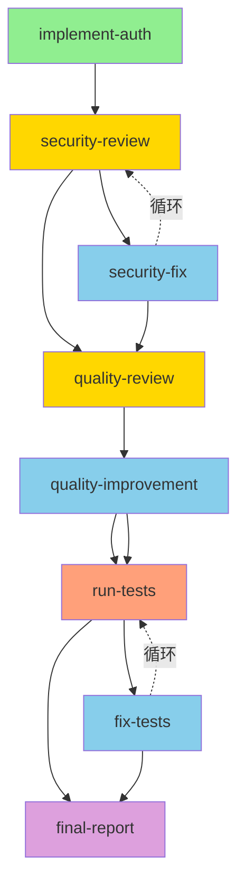

# 实战示例：智能代码审查工作流

**场景**: 实现一个新功能，然后通过自动循环的审查-修复流程确保代码质量

---

## 🎯 工作流目标

1. 实现一个用户认证功能
2. 自动审查代码安全性
3. 发现问题后自动修复
4. 重复审查-修复直到通过
5. 运行测试验证
6. 生成最终报告

---

## 📋 完整工作流定义

```typescript
runDynamicGraph({
  initialNodes: [
    // 节点 1: 实现功能
    {
      id: "implement-auth",
      task: `实现用户认证功能，包括：
1. JWT token 生成和验证
2. 密码哈希存储（使用 bcrypt）
3. 登录端点 POST /api/auth/login
4. 注册端点 POST /api/auth/register
5. Token 刷新端点 POST /api/auth/refresh

文件位置：src/auth/authService.ts, src/auth/authController.ts

要求：
- 使用 TypeScript
- 遵循项目现有代码风格
- 包含基本的输入验证`,
      role: "executor",
      exportTo: "implementationSummary"
    },

    // 节点 2: 安全审查（循环起点）
    {
      id: "security-review",
      task: `审查 src/auth/ 目录下的认证代码安全性。

检查项：
1. **SQL 注入防护**: 是否使用参数化查询
2. **XSS 防护**: 输入是否正确转义
3. **密码存储**: 是否使用强哈希算法（bcrypt/argon2）
4. **Token 安全**: JWT 密钥是否从环境变量读取，是否设置过期时间
5. **会话管理**: 是否正确处理登出和 token 失效
6. **错误处理**: 是否泄露敏感信息（如用户存在性）
7. **速率限制**: 登录接口是否有防暴力破解措施
8. **HTTPS**: 是否强制使用安全连接

输出格式：
如果所有检查通过，回复：
「APPROVED: 安全审查通过，未发现安全问题」

如果发现问题，按以下格式列出：
「发现 X 个安全问题：

【问题 1】SQL 注入风险
位置：src/auth/authService.ts:45
描述：直接拼接 SQL 查询，存在注入风险
建议：使用参数化查询

【问题 2】密码明文存储
位置：src/auth/authService.ts:78
描述：密码未经哈希直接存储
建议：使用 bcrypt.hash() 处理密码
」`,
      role: "reviewer",
      dependsOn: ["implement-auth"],
      exportTo: "securityReviewResult"
    },

    // 节点 3: 安全修复（条件执行）
    {
      id: "security-fix",
      task: `根据安全审查意见修复代码问题。

## 审查结果
{securityReviewResult}

要求：
1. 逐一修复所有列出的问题
2. 保持代码其他部分不变
3. 添加必要的注释说明修复内容
4. 确保修复后功能仍然正常工作

请详细说明每个问题的修复方法。`,
      role: "executor",
      dependsOn: ["security-review"],
      inputMapping: {
        securityReviewResult: "globalData.securityReviewResult"
      },
      condition: {
        type: "custom",
        expression: "!security-review.content.includes('APPROVED')"
      },
      exportTo: "fixSummary"
    },

    // 节点 4: 代码质量审查（串行）
    {
      id: "quality-review",
      task: `审查代码质量和最佳实践。

检查项：
1. **类型安全**: 是否有 any 类型，是否充分利用 TypeScript
2. **错误处理**: 是否有完善的 try-catch 和错误日志
3. **代码重复**: 是否有可以提取的公共逻辑
4. **命名规范**: 变量和函数命名是否清晰
5. **注释完整性**: 关键逻辑是否有注释
6. **测试覆盖**: 是否需要添加单元测试

输出格式：
如果质量良好，回复：
「APPROVED: 代码质量良好」

否则列出改进建议：
「建议改进 X 处：

【建议 1】添加类型定义
位置：src/auth/authService.ts:23
当前：function generateToken(user: any)
建议：function generateToken(user: User)
」`,
      role: "reviewer",
      dependsOn: ["security-review", "security-fix"],
      exportTo: "qualityReviewResult"
    },

    // 节点 5: 质量改进（条件执行）
    {
      id: "quality-improvement",
      task: `根据质量审查建议改进代码。

## 审查建议
{qualityReviewResult}

实施改进措施，提高代码质量。`,
      role: "executor",
      dependsOn: ["quality-review"],
      inputMapping: {
        qualityReviewResult: "globalData.qualityReviewResult"
      },
      condition: {
        type: "custom",
        expression: "!quality-review.content.includes('APPROVED')"
      }
    },

    // 节点 6: 运行测试
    {
      id: "run-tests",
      task: `运行单元测试验证功能正确性。

命令：npm test src/auth/

检查：
1. 所有测试是否通过
2. 是否有测试失败或错误
3. 测试覆盖率是否达标（> 80%）

如果测试全部通过，回复：
「✅ 所有测试通过 (覆盖率: XX%)」

如果有失败，详细列出失败的测试和错误信息。`,
      role: "executor",
      dependsOn: ["quality-review", "quality-improvement"],
      toolHints: ["runCommand"],
      exportTo: "testResult"
    },

    // 节点 7: 测试修复（条件执行）
    {
      id: "fix-tests",
      task: `修复失败的测试。

## 测试结果
{testResult}

分析失败原因并修复代码或测试。`,
      role: "executor",
      dependsOn: ["run-tests"],
      inputMapping: {
        testResult: "globalData.testResult"
      },
      condition: {
        type: "custom",
        expression: "!run-tests.content.includes('✅')"
      }
    },

    // 节点 8: 生成最终报告
    {
      id: "final-report",
      task: `生成最终的实现报告。

汇总以下信息：
1. 实现的功能列表
2. 安全审查结果和修复记录
3. 代码质量改进记录
4. 测试结果
5. 总共迭代轮数
6. 最终代码文件清单

## 数据源
- 实现摘要: {implementationSummary}
- 安全审查: {securityReviewResult}
- 修复记录: {fixSummary}
- 质量审查: {qualityReviewResult}
- 测试结果: {testResult}

输出格式化的 Markdown 报告。`,
      role: "planner",
      dependsOn: ["run-tests", "fix-tests"],
      inputMapping: {
        implementationSummary: "globalData.implementationSummary",
        securityReviewResult: "globalData.securityReviewResult",
        fixSummary: "globalData.fixSummary",
        qualityReviewResult: "globalData.qualityReviewResult",
        testResult: "globalData.testResult"
      }
    }
  ],

  // 🔄 循环边定义
  cycles: [
    // 循环 1: 安全审查 ↔ 安全修复
    {
      id: "security-qa-loop",
      from: "security-fix",
      to: "security-review",
      exit: {
        hardLimit: 5,  // 最多 5 轮安全修复
        
        breakWhen: [
          {
            type: "expression",
            value: "security-review.content.includes('APPROVED')",
            description: "安全审查通过",
            priority: "high"
          },
          {
            type: "expression",
            value: "security-review.content.includes('仅剩次要问题')",
            description: "只剩次要问题，可以收尾",
            priority: "medium"
          }
        ],

        adaptive: {
          detectNoProgress: true,
          progressWindow: 2,
          similarityThreshold: 0.85,  // 如果两轮审查结果相似度 > 85%，认为无进展
          costBudget: 80000  // 80k tokens 预算
        }
      }
    },

    // 循环 2: 测试 ↔ 修复
    {
      id: "test-fix-loop",
      from: "fix-tests",
      to: "run-tests",
      exit: {
        hardLimit: 3,  // 最多 3 轮测试修复
        
        breakWhen: [
          {
            type: "expression",
            value: "run-tests.content.includes('✅')",
            description: "测试全部通过",
            priority: "high"
          }
        ],

        adaptive: {
          detectNoProgress: true,
          progressWindow: 2,
          costBudget: 30000
        }
      }
    }
  ],

  // 可视化和调试
  include: ["visualization", "debug", "mermaid"]
});
```

---

## 📊 预期执行流程

### **正常流程（无问题）**
```
implement-auth
    ↓
security-review → APPROVED
    ↓
quality-review → APPROVED
    ↓
run-tests → ✅ 通过
    ↓
final-report
```

**总节点数**: 4  
**总执行时间**: ~2-3 分钟

---

### **需要 1 轮修复**
```
implement-auth
    ↓
security-review → 发现 3 个问题
    ↓
security-fix → 修复完成
    ↓
security-review → APPROVED ✅
    ↓
quality-review → APPROVED
    ↓
run-tests → ✅ 通过
    ↓
final-report
```

**总节点数**: 5  
**循环轮数**: 1  
**总执行时间**: ~3-4 分钟

---

### **需要多轮修复**
```
implement-auth
    ↓
security-review → 发现 5 个问题
    ↓
security-fix → 修复 3 个
    ↓
security-review → 还有 2 个问题 (循环轮 1)
    ↓
security-fix → 修复剩余 2 个
    ↓
security-review → APPROVED ✅ (循环轮 2)
    ↓
quality-review → 建议改进
    ↓
quality-improvement → 改进完成
    ↓
run-tests → 1 个测试失败
    ↓
fix-tests → 修复测试
    ↓
run-tests → ✅ 全部通过 (测试循环轮 1)
    ↓
final-report
```

**总节点数**: 8  
**循环轮数**: 安全 2 轮 + 测试 1 轮 = 3 轮  
**总执行时间**: ~5-7 分钟

---

## 🎯 循环退出场景

### **场景 1: 正常退出（条件满足）**
```
security-review 返回: "APPROVED: 安全审查通过"
→ breakWhen 条件满足
→ 循环停止 ✅
```

### **场景 2: 无进展退出**
```
第 1 轮 security-review: "发现 SQL 注入问题在 line 45"
第 2 轮 security-review: "发现 SQL 注入问题在 line 45" (相似度 95%)
→ 无进展检测触发
→ 循环停止 ⚠️
→ emit CycleStopped 事件
```

### **场景 3: 达到硬上限**
```
第 1-5 轮: 持续发现不同问题
第 6 轮: 达到 hardLimit
→ 循环停止 ⚠️
→ 生成的报告中会说明"已达到最大修复轮数"
```

### **场景 4: 预算耗尽**
```
累计 token 使用: 85000 (超过 80000)
→ costBudget 超限
→ 循环停止 ⚠️
→ emit CycleStopped 事件
```

---

## 📈 可视化图表

### **Mermaid 流程图**



---

## 🔧 使用方法

### **方式 1: 通过主智能体调用**

在对话中直接说：

```
请使用动态工作流实现用户认证功能，并通过自动审查-修复循环确保代码质量。
使用 examples/code-review-workflow-example.md 中定义的完整工作流。
```

### **方式 2: 作为脚本执行**

```typescript
import { runDynamicGraph } from './dynamicWorkflowTools';

// 使用上面的完整配置
const result = await runDynamicGraph({
  /* ... 上面的配置 ... */
});

console.log(result);
```

---

## 📊 预期输出

### **成功案例输出**

```json
{
  "nodes": [
    { "id": "implement-auth", "role": "executor" },
    { "id": "security-review", "role": "reviewer" },
    { "id": "security-fix", "role": "executor" },
    { "id": "quality-review", "role": "reviewer" },
    { "id": "run-tests", "role": "executor" },
    { "id": "final-report", "role": "planner" }
  ],
  "totalNodes": 8,
  "statusCounts": {
    "completed": 6,
    "skipped": 2
  },
  "completedNodes": [
    "implement-auth",
    "security-review",
    "security-fix",
    "quality-review",
    "run-tests",
    "final-report"
  ],
  "executionOrder": [
    "implement-auth",
    "security-review",
    "security-fix",
    "security-review",
    "quality-review",
    "run-tests",
    "final-report"
  ],
  "cycleStatistics": {
    "security-qa-loop": {
      "totalIterations": 2,
      "exitReason": "安全审查通过",
      "totalTokens": 45000
    },
    "test-fix-loop": {
      "totalIterations": 0,
      "exitReason": "测试首次通过",
      "totalTokens": 0
    }
  },
  "visualization": "...",
  "mermaid": "..."
}
```

---

## 🎓 学习要点

### **1. 条件节点的使用**
```typescript
{
  id: "security-fix",
  condition: {
    type: "custom",
    expression: "!security-review.content.includes('APPROVED')"
  }
}
```
只有审查未通过时才执行修复。

### **2. 数据流传递**
```typescript
{
  id: "security-fix",
  inputMapping: {
    securityReviewResult: "globalData.securityReviewResult"
  }
}
```
修复节点读取审查结果。

### **3. 智能退出条件**
```typescript
breakWhen: [
  {
    type: "expression",
    value: "security-review.content.includes('APPROVED')",
    priority: "high"
  },
  {
    type: "expression",
    value: "cycleState.currentIteration >= 3",
    priority: "medium"
  }
]
```
多个退出条件，任一满足即停止。

### **4. 无进展保护**
```typescript
adaptive: {
  detectNoProgress: true,
  progressWindow: 2,
  similarityThreshold: 0.85
}
```
避免陷入无意义的循环。

---

## 🚀 扩展建议

### **增强版功能**

1. **添加性能审查节点**
   - 检查 N+1 查询
   - 检查缓存策略
   
2. **添加文档生成节点**
   - API 文档
   - 使用说明

3. **添加部署准备节点**
   - 环境变量检查
   - 依赖版本锁定

### **多环境支持**

```typescript
// 开发环境：宽松审查
cycles: [{ exit: { hardLimit: 3 } }]

// 生产环境：严格审查
cycles: [{ 
  exit: { 
    hardLimit: 10,
    adaptive: { detectNoProgress: true }
  }
}]
```

---

## 📝 总结

这个示例展示了：
- ✅ 真实的代码审查场景
- ✅ 多个循环的协同工作
- ✅ 智能退出策略的实际应用
- ✅ 条件节点和数据流
- ✅ 完整的质量保证流程

**这是一个可以立即使用的生产级工作流！** 🎉
