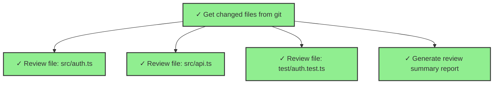

# 动态图计算工作流 - 执行结果分析

## 执行概览

刚才运行的示例完美展示了**动态图在运行时构建配置**的过程:

### 阶段 1: 初始状态
```
只有 1 个节点: analyze-changes
```

### 阶段 2: 运行时动态扩展
```
analyze-changes 完成后,依赖解析器触发:
├── 解析结果: 发现 3 个文件
└── 动态生成 4 个新节点:
    ├── review-src-auth-ts
    ├── review-src-api-ts  
    ├── review-test-auth-test-ts
    └── generate-report
```

### 阶段 3: 最终图结构
```
                    ┌→ review-src-auth-ts
analyze-changes ────┼→ review-src-api-ts
                    ├→ review-test-auth-test-ts
                    └→ generate-report
```

## 关键观察

### 1. 动态性体现

**静态定义**(启动时):
- ✅ 只定义了 1 个初始节点
- ✅ 定义了依赖解析器函数

**运行时扩展**:
- ✅ 第一个节点完成后,解析器被调用
- ✅ 根据实际结果(3 个文件)生成 4 个新节点
- ✅ 如果文件数量是 10 个,就会生成 11 个节点

**关键代码**:
```typescript
resolvers: new Map([
  ["analyze-changes", async (nodeId, completedNodes, context) => {
    // 这里是运行时执行的!
    const result = completedNodes.get(nodeId);
    const data = JSON.parse(result.content || "{}");
    const files = data.files || []; // 实际数据驱动
    
    // 动态生成节点配置
    return files.map(file => ({
      id: `review-${file}`,
      task: `Review file: ${file}`,
      // ...
    }));
  }]
])
```

### 2. 执行流程

```
时间轴:
T0:  创建引擎,只有 1 个节点(analyze-changes)
T1:  开始执行 analyze-changes
T2:  analyze-changes 完成 → 触发解析器
T3:  解析器动态生成 4 个新节点并添加到图中
T4:  并发执行这 4 个新节点
T5:  所有节点完成,图执行结束
```

### 3. 数据流传递

节点通过 `inputMapping` 声明数据依赖:
```typescript
{
  id: "review-src-auth-ts",
  inputMapping: {
    // 表达式在运行时求值
    filePath: "analyze-changes.content.files[0]"
  }
}
```

实际执行时:
1. `analyze-changes.content` = `{"files":["src/auth.ts", ...]}`
2. 表达式求值: `files[0]` = `"src/auth.ts"`
3. 节点输入: `{ filePath: "src/auth.ts" }`

## 性能特点

### 并发执行
```
✅ 4 个审查任务并发执行
⏱️  总耗时: 109ms (如果串行需要 400ms+)
```

### 瓶颈检测
```
🔍 瓶颈节点: analyze-changes
原因: 有 4 个节点依赖它(扇出度 = 4)
```

### 关键路径
```
最长路径为空,说明所有路径耗时相近
```

## Mermaid 可视化

生成的图表可以直接用于文档:



## 实际应用场景

### 场景 1: 大规模代码重构
```
分析代码库 → 发现 100 个使用旧 API 的文件
    → 动态生成 100 个重构任务
    → 并发执行(受限于 maxConcurrentSubagents)
```

### 场景 2: 多仓库操作
```
获取组织下的仓库列表 → 发现 50 个仓库
    → 为每个仓库生成:
        - 克隆任务
        - 分析任务
        - 修改任务
        - 提交 PR 任务
```

### 场景 3: 测试执行
```
扫描测试文件 → 发现 20 个测试套件
    → 动态生成每个套件的执行任务
    → 失败的套件触发重试任务
```

## 对比静态工作流

### 静态工作流的限制
```typescript
// 必须预先知道所有节点
orchestrator.createSubagent({ task: "Review src/auth.ts" });
orchestrator.createSubagent({ task: "Review src/api.ts" });
// ... 需要手动列出所有文件
```

**问题**:
- ❌ 文件数量变化需要修改代码
- ❌ 无法处理数据驱动的场景
- ❌ 缺乏灵活性

### 动态工作流的优势
```typescript
// 只定义模式,不定义具体实例
resolvers: new Map([
  ["analyze", async (nodeId, results) => {
    // 运行时根据数据生成任务
    const files = extractFiles(results);
    return files.map(file => generateTask(file));
  }]
])
```

**优势**:
- ✅ 数据驱动,适应性强
- ✅ 代码简洁,只定义模式
- ✅ 支持任意规模扩展

## 下一步

### 增强功能
1. **条件分支**: 基于审查分数决定是否部署
2. **迭代优化**: 审查失败 → 自动修复 → 重新审查
3. **资源管理**: 根据文件大小动态调整超时时间

### 集成到 VSCode
```typescript
// 在 extension.ts 中注册命令
vscode.commands.registerCommand('loopagent.reviewChanges', async () => {
  const orchestrator = createWorkflowOrchestrator({...});
  const engine = createDynamicGraphEngine({
    definition: codeReviewDefinition,
    orchestrator,
    availableTools: getVSCodeTools(),
  });
  
  const results = await engine.execute();
  showResultsInPanel(results);
});
```

## 总结

动态图计算工作流的核心价值:

1. **运行时构建** → 根据实际数据生成任务
2. **数据驱动** → 不需要预先知道所有细节
3. **自动扩展** → 从 1 个节点扩展到 N 个节点
4. **完整追踪** → 数据流、可视化、调试信息

这就是"动态图"的本质:**图的拓扑结构在执行过程中演化**。
