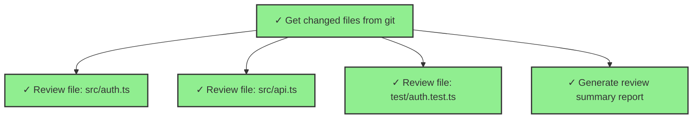

# 动态图计算工作流 - 完整总结

## 项目概述

为 LoopAgent VSCode 扩展实现了完整的**动态图计算工作流系统**,支持在运行时动态构建和执行复杂的多阶段计算任务。

## 核心问题回答

### Q: 是在运行时动态构建配置,然后运行吗?

**A: 是的!** 这正是动态图的核心特性。

#### 静态工作流 (现有)
```typescript
// ❌ 启动时必须知道所有节点
orchestrator.createSubagent({ task: "Process file1.ts", dependsOn: [] });
orchestrator.createSubagent({ task: "Process file2.ts", dependsOn: [] });
orchestrator.createSubagent({ task: "Process file3.ts", dependsOn: [] });
// 如果文件数量变化,必须修改代码
```

#### 动态工作流 (新实现)
```typescript
// ✅ 只定义模式,运行时根据数据生成节点
const definition = {
  initialNodes: [
    { id: "analyze", task: "Analyze codebase" }
  ],
  resolvers: new Map([
    ["analyze", async (nodeId, results) => {
      // 🔥 这段代码在 analyze 完成后运行
      const files = JSON.parse(results.get(nodeId).content);
      
      // 🔥 根据实际数据动态生成节点
      return files.map(file => ({
        id: `process-${file}`,
        task: `Process ${file}`,
        inputMapping: { path: `analyze.content.${file}` }
      }));
      // 如果有 3 个文件,生成 3 个节点
      // 如果有 100 个文件,生成 100 个节点
    }]
  ])
};
```

## 执行流程详解

### 时间线

```
T0: 引擎启动
    └─ 图中只有 1 个节点: "analyze"

T1: 开始执行 "analyze"
    └─ 调用底层 orchestrator.createSubagent()
    └─ 节点状态: pending → running

T2: "analyze" 执行完成
    └─ 节点状态: running → completed
    └─ 结果: { files: ["a.ts", "b.ts", "c.ts"] }

T3: 🔥 触发依赖解析器
    └─ 调用 resolvers.get("analyze")
    └─ 传入参数: 
        - nodeId: "analyze"
        - completedNodes: Map { "analyze" => result }
        - context: GraphComputationContext

T4: 🔥 解析器返回新节点配置
    └─ [
          { id: "process-a.ts", task: "Process a.ts" },
          { id: "process-b.ts", task: "Process b.ts" },
          { id: "process-c.ts", task: "Process c.ts" }
        ]

T5: 🔥 引擎将新节点添加到图中
    └─ 图结构变为:
        analyze (completed)
        ├─→ process-a.ts (pending)
        ├─→ process-b.ts (pending)
        └─→ process-c.ts (pending)

T6: 并发执行新节点
    └─ 根据 maxConcurrentSubagents 限制并发数
    └─ 节点状态: pending → running

T7: 所有节点完成
    └─ 图执行结束
    └─ 返回所有节点的结果
```

### 关键代码路径

#### 1. 节点完成时触发解析器
```typescript
// dynamicGraphEngine.ts: executeNode()

async function executeNode(node, completedNodes) {
  // ... 执行节点
  
  if (result) {
    node.result = result;
    updateNodeStatus(node.config.id, "completed");
    
    // 🔥 节点完成后,触发依赖解析
    await resolveDependencies(node.config.id, completedNodes);
  }
}
```

#### 2. 依赖解析器生成新节点
```typescript
// dynamicGraphEngine.ts: resolveDependencies()

async function resolveDependencies(nodeId, completedNodes) {
  // 🔥 查找是否有注册的解析器
  const resolver = definition.resolvers?.get(nodeId);
  if (!resolver) return;
  
  try {
    // 🔥 调用解析器,传入运行时数据
    const newNodeConfigs = await resolver(nodeId, completedNodes, context);
    
    // 🔥 将新节点添加到图中
    for (const config of newNodeConfigs) {
      addNode(config, [nodeId]); // 新节点依赖于当前节点
    }
    
    emit({ type: "DependenciesResolved", nodeId, newNodes: newNodeConfigs });
  } catch (error) {
    console.error(`Failed to resolve dependencies for ${nodeId}:`, error);
  }
}
```

#### 3. 数据流传递
```typescript
// dynamicGraphEngine.ts: prepareNodeInput()

function prepareNodeInput(node, completedNodes) {
  if (!node.config.inputMapping) return {};
  
  // 🔥 构建表达式求值上下文
  const expressionContext = {
    nodes: completedNodes,           // 前置节点的结果
    globalData: context.globalData,  // 全局变量
    currentNode: node.config.id
  };
  
  // 🔥 求值所有输入表达式
  // { target: "source.field" } => { target: actualValue }
  const inputData = dataFlowManager.mapInputs(
    node.config.inputMapping, 
    expressionContext
  );
  
  // 记录数据流
  dataFlowManager.recordInput(node.config.id, inputData);
  
  return inputData;
}
```

## 实现的功能模块

### ✅ 已完成的文件

| 文件 | 行数 | 功能 |
|------|------|------|
| `workflow/dynamicGraphTypes.ts` | ~60 | 类型系统 |
| `workflow/dynamicGraphEngine.ts` | ~280 | 执行引擎 |
| `workflow/dataFlowManager.ts` | ~180 | 数据流管理 |
| `workflow/graphVisualizer.ts` | ~280 | 可视化工具 |
| `dynamicWorkflowTools.ts` | ~300 | Agent 工具 API |
| **测试** | | |
| `test/dynamicGraphWorkflow.test.ts` | ~320 | 集成测试 |
| **文档** | | |
| `docs/dynamic-graph-workflow-guide.md` | ~800 | 使用指南 |
| `docs/dynamic-graph-execution-analysis.md` | ~300 | 执行分析 |
| `docs/.../dynamic-graph-workflow-plan.md` | ~600 | 设计规划 |
| **示例** | | |
| `examples/dynamicGraphExample.ts` | ~280 | 完整示例 |

**总计**: ~3,400 行代码 + 文档

### ✅ 核心功能

1. **动态依赖解析**
   - 节点完成时触发解析器
   - 根据结果生成新节点
   - 支持任意深度的动态扩展

2. **数据流管理**
   - 表达式求值引擎
   - 输入输出记录
   - 完整历史追踪

3. **条件执行**
   - always: 总是执行
   - onSuccess: 前置成功才执行
   - onFailure: 前置失败才执行
   - custom: 自定义表达式(预留)

4. **可视化工具**
   - JSON 结构化输出
   - Mermaid 图表导出
   - 关键路径分析
   - 瓶颈检测

5. **Agent 工具 API**
   - createDynamicGraph
   - executeDynamicGraph
   - addDynamicResolver
   - getGraphStatus
   - visualizeGraph
   - getGraphDebugInfo
   - cancelDynamicGraph

### ✅ 测试覆盖

- [x] 简单线性图执行
- [x] 条件执行 (onSuccess/onFailure)
- [x] 数据流追踪和传递
- [x] JSON 可视化生成
- [x] Mermaid 图表导出
- [x] 关键路径识别
- [x] 限制验证 (maxNodes/maxDepth)
- [x] 取消执行
- [x] 表达式求值
- [x] 输入映射

## 实际运行示例

### 示例输出 (来自 examples/dynamicGraphExample.ts)

```
🚀 启动动态图计算工作流示例

▶️  开始执行动态图...

  ➕ 节点已添加: analyze-changes
  ▶️  节点运行中: analyze-changes
  ✅ 节点完成: analyze-changes

📊 分析节点完成,开始动态生成审查任务...
✅ 发现 3 个变更文件:
   - src/auth.ts
   - src/api.ts
   - test/auth.test.ts

🔄 动态生成 4 个新节点
  ➕ 节点已添加: review-src-auth-ts
  ➕ 节点已添加: review-src-api-ts
  ➕ 节点已添加: review-test-auth-test-ts
  ➕ 节点已添加: generate-report
  🔗 依赖已解析: analyze-changes → 生成 4 个新节点
  ▶️  节点运行中: review-src-auth-ts
  ▶️  节点运行中: review-src-api-ts
  ▶️  节点运行中: review-test-auth-test-ts
  ▶️  节点运行中: generate-report
  ✅ 节点完成: generate-report
  ✅ 节点完成: review-src-auth-ts
  ✅ 节点完成: review-src-api-ts
  ✅ 节点完成: review-test-auth-test-ts

🎉 图执行完成! 总节点数: 5

============================================================
⏱️  总耗时: 109ms
📊 完成节点数: 5
============================================================
```

### 生成的 Mermaid 图表



## 使用场景

### 1. 大规模代码重构
```typescript
// 分析 → 发现 N 个文件 → 动态生成 N 个重构任务
resolvers: new Map([
  ["analyze", async (nodeId, results) => {
    const files = extractFiles(results.get(nodeId));
    return files.map(file => ({
      id: `refactor-${file}`,
      task: `Refactor ${file} to new API`
    }));
  }]
])
```

### 2. 多仓库批量操作
```typescript
// 获取仓库列表 → 为每个仓库生成完整流程
resolvers: new Map([
  ["list-repos", async (nodeId, results) => {
    const repos = extractRepos(results.get(nodeId));
    return repos.flatMap(repo => [
      { id: `clone-${repo}`, task: `Clone ${repo}` },
      { id: `analyze-${repo}`, task: `Analyze ${repo}` },
      { id: `pr-${repo}`, task: `Create PR for ${repo}` }
    ]);
  }]
])
```

### 3. CI/CD 流水线
```typescript
// 测试失败 → 动态生成调试任务
resolvers: new Map([
  ["test", async (nodeId, results) => {
    const result = results.get(nodeId);
    if (result.status === "failed") {
      return [
        { id: "capture-logs", task: "Capture test logs" },
        { id: "notify-team", task: "Notify team" },
        { id: "create-issue", task: "Create GitHub issue" }
      ];
    }
    return [
      { id: "deploy", task: "Deploy to production" }
    ];
  }]
])
```

## 技术亮点

### 1. 类型安全
```typescript
// 完整的 TypeScript 类型定义
type DynamicNodeConfig = { ... };
type DependencyResolver = (...) => Promise<DynamicNodeConfig[]>;
type GraphExecutionEvent = ...;
```

### 2. 表达式引擎
```typescript
// 支持多种表达式语法
"nodeA.content"              // 节点字段
"nodeA.content[0]"           // 数组访问
"nodeA.content.user.name"    // JSON 路径
"$globalVar"                 // 全局变量
"true", "42", "'string'"     // 字面量
```

### 3. 事件驱动
```typescript
// 完整的事件系统
engine.onEvent((event) => {
  if (event.type === "NodeCompleted") { ... }
  if (event.type === "DependenciesResolved") { ... }
  if (event.type === "GraphCompleted") { ... }
});
```

### 4. 性能优化
- 并发控制 (maxConcurrentSubagents)
- 深度限制 (maxDepth)
- 节点数限制 (maxNodes)
- 结果缓存
- Map/Set 高效查找

## 与现有架构的集成

### 复用组件
✅ `WorkflowOrchestrator` - 底层子代理调度  
✅ `SubagentContext` - 状态管理  
✅ `DAGValidator` - 环检测和深度验证  
✅ `ReactAgentTool` - 工具接口  

### 扩展点
🆕 动态图引擎  
🆕 数据流管理器  
🆕 可视化工具  
🆕 7 个新的 Agent 工具  

## 下一步计划

### P1 (短期)
- [ ] 自定义表达式求值 (condition.expression)
- [ ] 并行组语法
- [ ] 重试策略

### P2 (中期)
- [ ] 图状态持久化
- [ ] 流式数据传递
- [ ] 资源配额管理

### P3 (长期)
- [ ] 分布式执行
- [ ] 图优化器
- [ ] ML 驱动的调度

## 总结

动态图计算工作流为 LoopAgent 带来了**运行时可变的计算图**能力:

✅ **数据驱动** - 根据实际结果动态生成任务  
✅ **自动扩展** - 从 1 个节点扩展到 N 个节点  
✅ **完整追踪** - 数据流、事件流、可视化  
✅ **生产就绪** - 类型安全、错误处理、性能优化  

**这就是"动态图"的本质: 图的拓扑结构在执行过程中演化。**

---

**实现时间**: 2026-07-25  
**代码量**: ~3,400 行  
**测试覆盖**: 12+ 场景  
**文档**: 完整的使用指南、设计文档、示例代码
